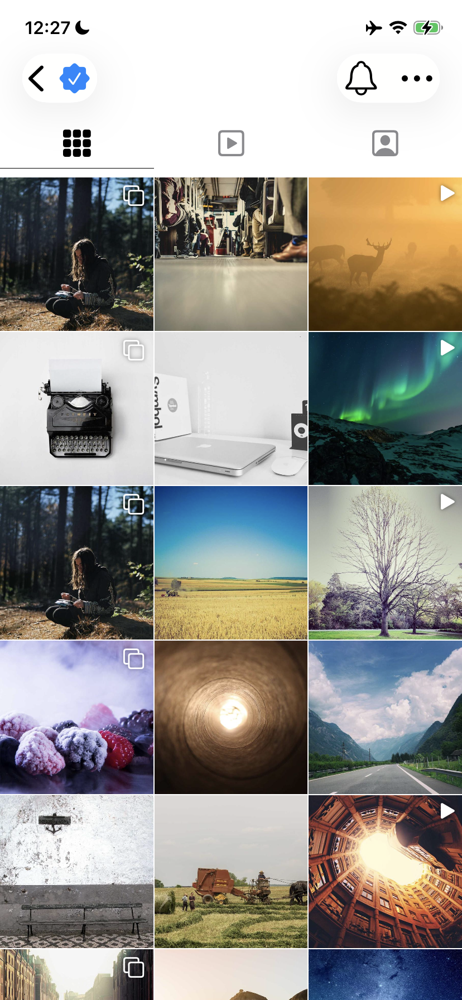

# Instagram Image Gallery

A SwiftUI demo that replicates Instagram's image gallery and post detail transition — including the zoom hero animation, interactive edge-swipe dismiss with device corner radius, and gallery scale-out effect.

## Demo

<p align="center">
  
</p>

<p align="center">
  <video src="demo.mov" width="300" />
</p>

## Features

- **3-column image grid** — `LazyVGrid` with 1pt spacing, square cells, multi-image and video indicators
- **Zoom hero transition** — powered by `.matchedTransitionSource` and `.navigationTransition(.zoom)` (iOS 18+)
- **Interactive dismiss** — swipe from the left edge to scale down the detail page with device corner radius, just like Instagram
- **Gallery depth effect** — the gallery subtly scales out when pushing into detail, all handled by the system
- **In-memory image cache** — `CachedAsyncImage` with synchronous `NSCache` lookups to eliminate placeholder flashes during transitions and grid scrolling
- **Transition fallback layer** — a per-cell safety net behind `matchedTransitionSource` to prevent white/black flashes on fast interactive pops

## Requirements

- iOS 18.0+
- Xcode 16.0+
- Swift 5.9+

## Project Structure

```
InstagramImageGallery/
├── InstagramImageGalleryApp.swift   # App entry point
├── ContentView.swift                # Gallery grid + zoom transition orchestration
├── PostDetailView.swift             # Post detail page (header, image, actions, caption)
├── ImageCache.swift                 # NSCache-backed image cache + CachedAsyncImage view
├── Post.swift                       # Data model with sample posts (picsum.photos)
└── Assets.xcassets/                 # Asset catalog
```

## How It Works

### Zoom Transition

Two modifiers drive the entire transition — no custom gesture or animation code:

```swift
// On each grid cell (source):
.matchedTransitionSource(id: post.id, in: heroNamespace)

// On the detail destination:
.navigationTransition(.zoom(sourceID: post.id, in: heroNamespace))
```

The system handles the push/pop animation, interactive edge-swipe gesture, scaling, device corner radius, and spring physics.

### Fallback Layer

`matchedTransitionSource` has a timing bug where fast interactive pops can leave the source cell blank. A `CachedAsyncImage` fallback sits behind each `NavigationLink` — invisible to the transition system — to guarantee the cell always shows its image after dismissal. See the detailed comments in `ContentView.swift`.

## License

This project is for educational and demonstration purposes.
